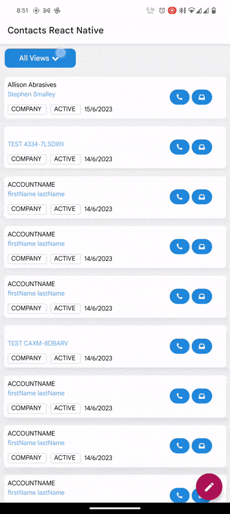
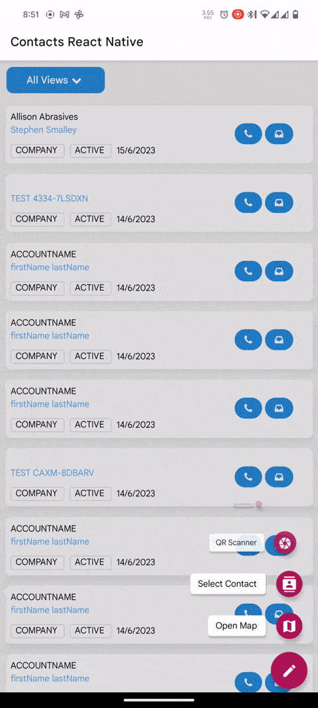
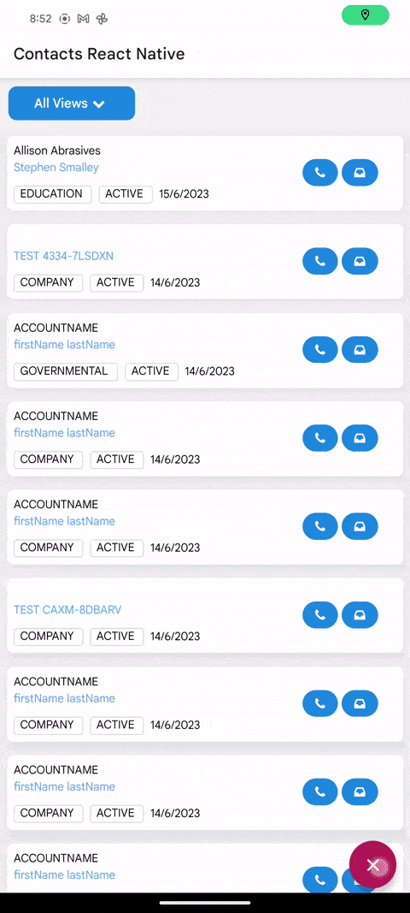
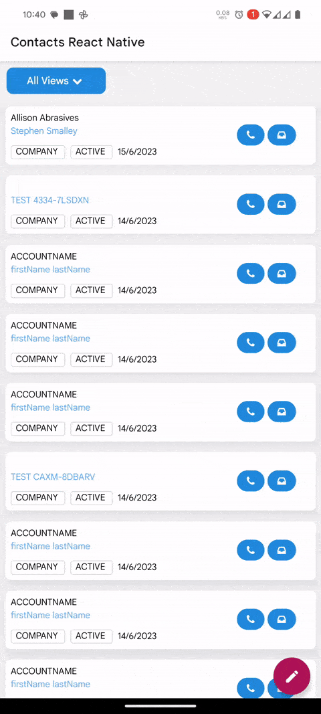

# Contacts Manager

A react native app for managing contacts.

## Technologies Used
- [React Native](https://reactnative.dev/)
- [Expo](https://expo.io/)
- [Tailwind CSS](https://www.nativewind.dev/)
- [NativeElements](https://reactnativeelements.com/docs)

## Installation
**Note:** Make sure you have node v18+
```bash
yarn install # or npm install
```

## Features
### Google Maps Integration
Shows the location of current user



### Contacts
#### Contacts Dial

#### Contacts from Mobile Phone


### Offline first philosophy
We make a request to server if internet connection is available else we store data in local storage(async storage)

 

### QR Code scanner
Scan any QR code



